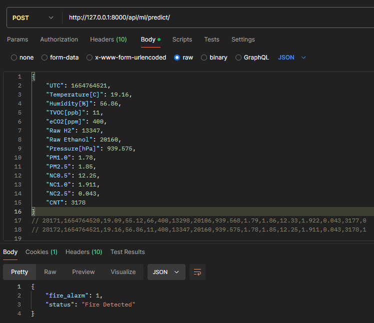
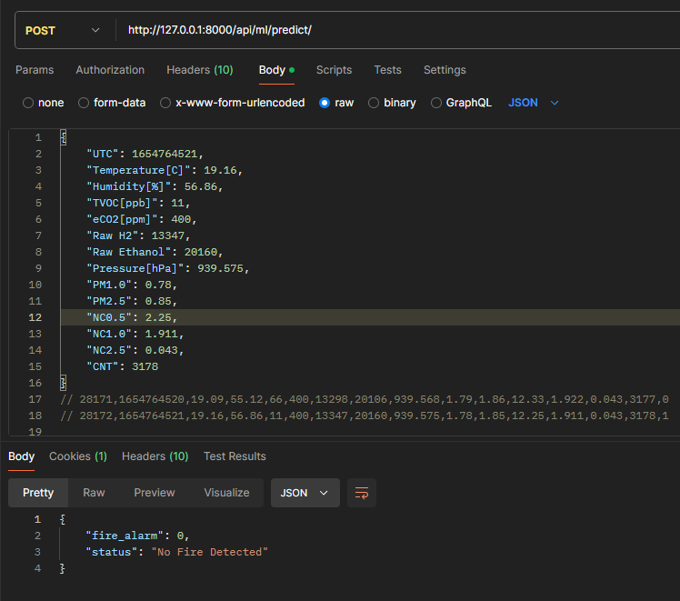
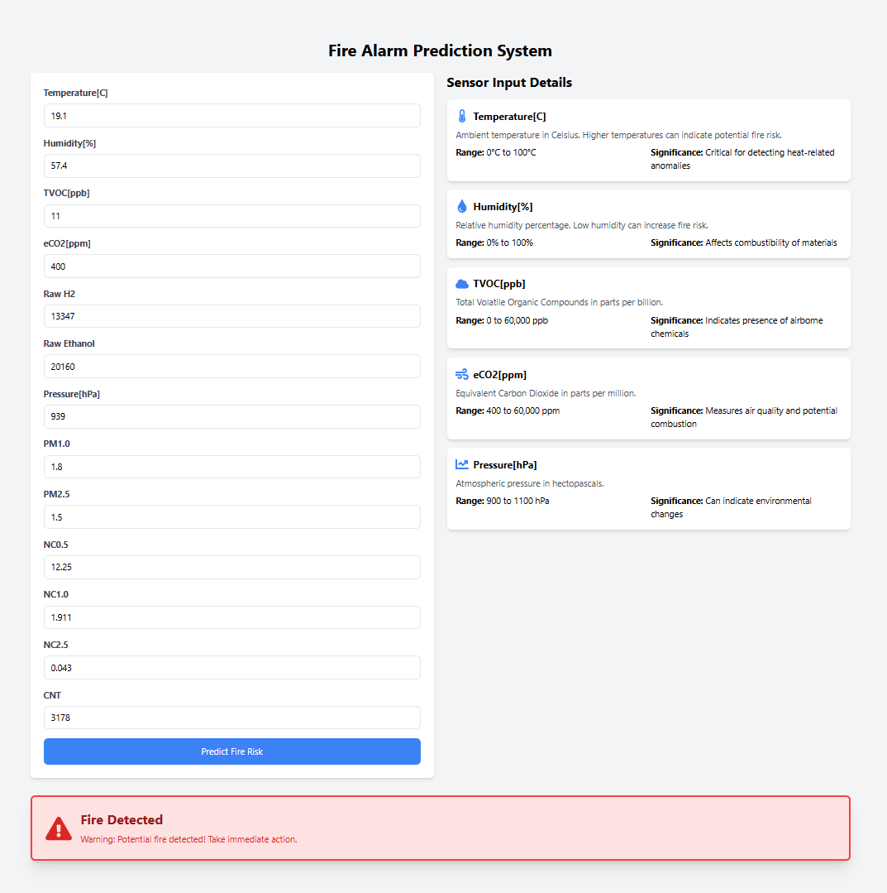
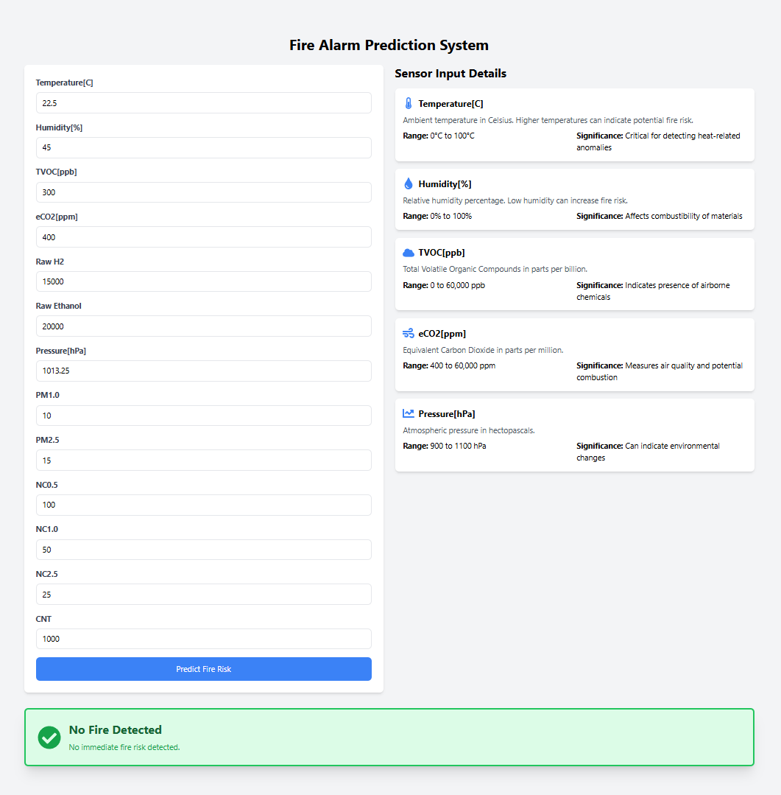

## Steps to run

1 Setup required files

- Download training data, scaler and models from https://drive.google.com/drive/folders/1yGgL73EAgUJj2yFVHV6dmiIM908_4UHA?usp=drive_link
- Place `smoke_detection_iot.csv` in `training\input\smoke-detection-dataset` folder
- Place scaler and models in `training\out` folder
- Update paths in `api\ml_models\utils.py`

2 Run backend

- `python -m venv venv`
- `venv\Scripts\activate`
- `cd api`
- `pip install -r requirements.txt`
- Start backend server: `py manage.py runserver`
- Send POST request with curl:

```
curl -X POST http://localhost:8000/api/ml/predict/ \
     -H "Content-Type: application/json" \
     -d '{
          "UTC": 1654764521,
          "Temperature[C]": 19.16,
          "Humidity[%]": 56.86,
          "TVOC[ppb]": 11,
          "eCO2[ppm]": 400,
          "Raw H2": 13347,
          "Raw Ethanol": 20160,
          "Pressure[hPa]": 939.575,
          "PM1.0": 1.78,
          "PM2.5": 1.85,
          "NC0.5": 12.25,
          "NC1.0": 1.911,
          "NC2.5": 0.043,
          "CNT": 3178
     }'

# {"fire_alarm":1,"status":"Fire Detected"}
```

## Output

| Fire Detected            | No Fire Detected         |
| ------------------------ | ------------------------ |
|  |  |

3 Run frontend

- `cd ../frontend`
- `yarn`
- `yarn dev`

## Output

| Fire Detected            | No Fire Detected         |
| ------------------------ | ------------------------ |
|  |  |
